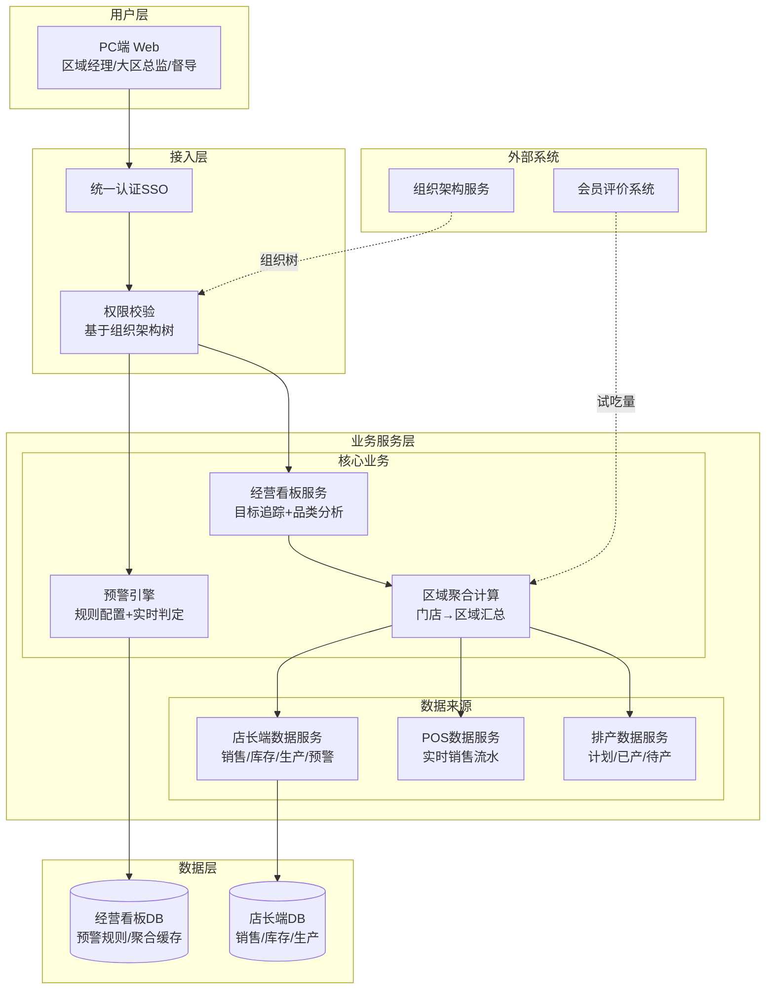
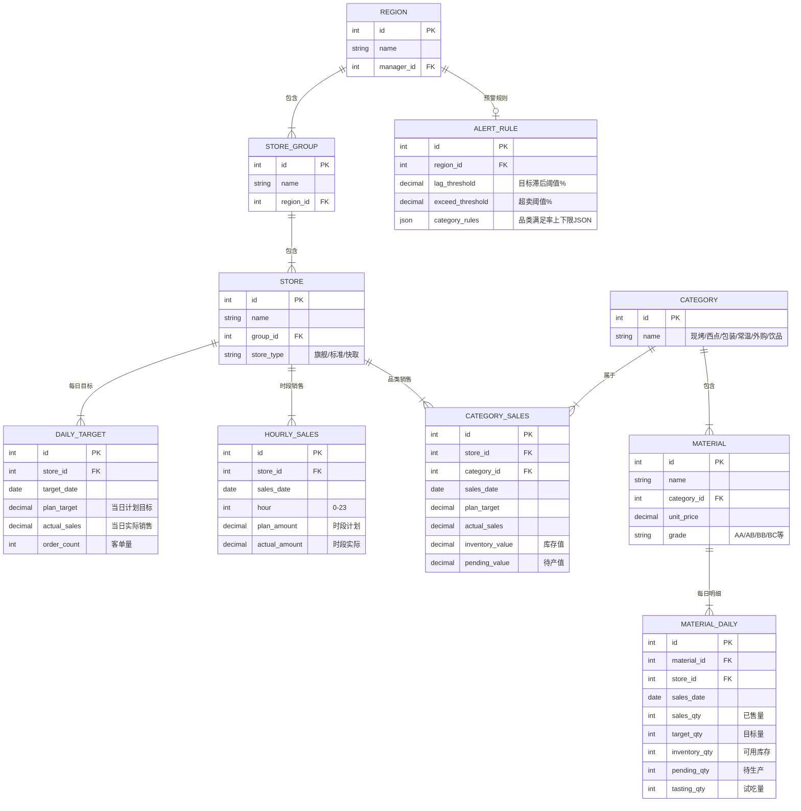
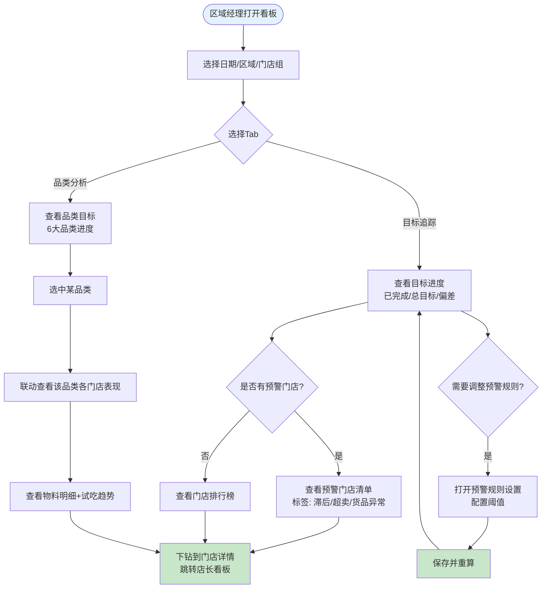

# 区域经理经营看板 PRD

| PRD 审核人 | [TODO] |
| --- | --- |
| 重要性 | 高 |
| 紧迫性 | 高 |
| 需求方 | 运营管理部 |
| PRD 编写人 | 产品经理 |
| PRD 提交日期 | 2026-05-18 |

## PRD 修改记录

| 变更时间 | 变更内容 | 变更提出部门与理由 | 修改人 | 审核人 | 版本号 |
| --- | --- | --- | --- | --- | --- |
| 2026-05-18 | 初始版本 | — | 产品经理 | [TODO] | v1.0 |

---

## 产品定型

| 维度 | 结论 |
| --- | --- |
| 商业属性 | 企业自研系统（连锁烘焙总部智慧门店产品，不对外销售） |
| 功能类型 | 业务型管理软件（多角色协同 + 长业务链 + 复杂状态管理） |

> 💡 方法论提示：基于《决胜B端》产品四大分类。据此，第3章替换为"同类系统调研+痛点优先级"，第10章ER+泳道+状态机完整覆盖。
## 1、项目背景

### 1.1 业务现状

公司为烘焙连锁企业，旗下门店分布于多个城市。组织架构为：总部 → 大区 → 区域 → 门店。每位区域经理负责 8—30 家门店的日常运营管理。

当前系统情况：
- **已上线**：智慧门店店长端（含日目标管理、智能要货、生产任务、销售看板）
- **未上线**：区域经理端经营看板（本期需求）
- **现有工具**：区域经理通过逐店登录店长看板 + 微信群 + Excel 手动汇总进行管理

### 1.2 面临问题

| 优先级 | 问题 | 具体描述 | 影响范围 |
| --- | --- | --- | --- |
| P0 | 全景视图缺失 | 区域经理需逐店登录店长看板，一上午看不完所有门店 | 全部区域经理（约50人） |
| P0 | 异常发现严重滞后 | 依赖店长上报或早晚会复盘，错过黄金干预窗口（高峰时段） | 全部区域经理 |
| P1 | 横向对比困难 | 线下 Excel 拉数据对比，T+1 口径不统一 | 全部区域经理 |
| P1 | 预警阈值无法统一管理 | 各店各做预警，区域内无统一执行标准 | 全部区域经理+店长 |
| P2 | 品类级问题归因难 | 无法快速定位"哪个品类、哪些门店、哪些SKU拉了后腿" | 区域经理+督导 |

### 1.3 解决思路

构建"区域经理经营看板"，以"目标追踪"和"品类分析"两个核心视角为主体，提供：
1. 区域级目标进度实时汇总（替代逐店查看）
2. 多门店横向排行与偏差对比（替代 Excel 手动汇总）
3. 统一预警规则配置 + 预警门店自动清单（替代等店长上报）
4. 品类 × 门店 × 物料三级下钻（替代线下归因分析）

### 1.4 决策依据

- 店长端销售看板上线后，店长目标达成率提升 8%，验证了实时看板的业务价值
- 区域经理日均花费 2.5 小时逐店查看数据，预计本系统可节省 80% 以上时间
- 区域经理反馈异常平均发现滞后 3—5 小时，预计缩短至 30 分钟内
## 2、需求基本情况

| 要素 | 内容 |
| --- | --- |
| **需求提出人** | 运营管理部负责人 |
| **功能使用人** | 区域经理、大区总监、运营督导 |
| **受影响人** | 门店店长（接收区域经理下达的指令）、后厨（排产调整） |
| **场景描述** | 见下方详细场景 |
| **发生频率** | 日均 3—5 次集中查看（早会前/高峰期/晚复盘），持续全天 |
| **核心痛点** | 区域经理无法实时掌握多店经营全景，异常发现滞后导致错过干预窗口 |
| **需求价值** | 缩短异常响应时间、提升区域月度达成率、降低报损率 |

> 💡 方法论提示：基于《决胜B端》需求发现十三要素五步法

### 核心场景描述

**场景1：早会前快速摸底**
- **人物**：张经理，36岁，某区域经理，管理12家门店
- **时间**：每天 08:30—09:00
- **地点**：办公室 PC 端
- **起因**：需要在 30 分钟内了解昨日复盘 + 今日开店准备情况
- **经过**：当前逐一登录 12 家门店的店长看板，手工记录数据到 Excel
- **结果**：耗时超过 1 小时仍看不完，早会延迟或信息不全

**场景2：高峰时段盯异常**
- **人物**：张经理
- **时间**：10:00—14:00 / 16:00—20:00
- **地点**：外出巡店途中（平板/手机）或办公室 PC
- **起因**：某门店可能出现目标滞后或品类缺货
- **经过**：当前依赖店长微信群上报，响应不及时
- **结果**：异常已发生 3—5 小时才发现，缺货损失无法挽回

**场景3：月中冲刺督导**
- **人物**：张经理
- **时间**：每月 15、25 日左右
- **地点**：办公室 PC 端
- **起因**：需要判断区域月度目标能否达成，识别落后门店
- **经过**：当前用 Excel 拉上半月数据手工计算达成率和偏差
- **结果**：数据 T+1，口径不统一，难以精准定位落后原因
## 3、业务分析与系统调研

> 💡 方法论提示：企业自研系统不做市场规模和竞品市场份额分析，替换为"同类系统调研 + 痛点优先级"

### 3.1 同类系统调研

| 调研对象 | 类型 | 核心能力 | 可借鉴点 | 局限性 |
| --- | --- | --- | --- | --- |
| 店长端销售看板（已上线） | 内部 | 单店经营状况、目标追踪、预警（缺货/报损/目标/评价）、加减货闭环 | 计算公式体系完整、预警规则成熟 | 仅支持单店维度，无跨店汇总 |
| 美团餐饮商家版-多店管理 | 外部 | 多店营业额汇总、门店排行、异常提醒 | 多店汇总+排行的交互范式 | 餐饮场景，无烘焙生产排产逻辑 |
| 有赞连锁-区域管理后台 | 外部 | 门店目标下达、达成率看板、品类分析 | 目标追踪+品类分析的数据维度 | SaaS 通用型，不支持烘焙短保品类特殊逻辑 |

### 3.2 业务痛点优先级

| 排序 | 痛点描述 | 影响范围 | 严重程度 | 紧迫度 | 涉及部门 |
| --- | --- | --- | --- | --- | --- |
| 1 | 无区域级实时全景视图，逐店查看效率极低 | 全部区域经理 | 高 | 高 | 运营管理部 |
| 2 | 异常门店无法实时预警，错过干预窗口 | 全部区域经理+门店 | 高 | 高 | 运营管理部 |
| 3 | 预警规则各店不统一，区域标准无法落地 | 全部区域经理+店长 | 中 | 高 | 运营管理部 |
| 4 | 门店间无横向排行对比，无法激励竞争 | 全部区域经理 | 中 | 中 | 运营管理部 |
| 5 | 品类级归因困难，不知道哪个品类哪个店拖后腿 | 区域经理+督导 | 中 | 中 | 运营管理部 |

### 3.3 投入产出初步评估

| 维度 | 估算 |
| --- | --- |
| **预计投入** | 前端 2 人 + 后端 2 人 + 产品 1 人 + 测试 1 人，约 2 个月 |
| **效率提升** | 区域经理日均节省 2 小时（从 2.5h 降至 0.5h），月度节省 50人×2h×22天=2,200 人时 |
| **业务价值** | 异常响应缩短至 30 分钟，预计区域达成率提升 3—5%，报损率下降 1pct |
## 4、项目收益目标

> 💡 方法论提示：SMART原则（具体、可衡量、可实现、相关性、有时限）

### 4.1 项目目标

| 目标类型 | 目标描述 | 衡量指标 | 目标值 | 达成时限 |
| --- | --- | --- | --- | --- |
| **核心业务目标** | 提升区域月度目标达成率 | 区域月度达成率 | ≥ 95%（当前约 88%） | 上线后 3 个月 |
| **核心业务目标** | 缩短异常响应时间 | 从发现异常到下达指令的时长 | ≤ 30 分钟（当前 3—5 小时） | 上线后 1 个月 |
| **效率目标** | 减少区域经理数据查看时间 | 日均数据查看耗时 | 降至 ≤ 30 分钟（当前 2.5h） | 上线后 2 周 |
| **效率目标** | 降低区域综合报损率 | 区域月报损率 | 同比下降 ≥ 1pct | 上线后 3 个月 |
| **体验目标** | 区域经理看板功能采纳率 | 日活区域经理占比 | ≥ 90% | 上线后 1 个月 |

### 4.2 验收标准

1. 目标追踪 Tab 功能完整：目标进度、时段柱图、气泡卡片、客单量/客单价、预警门店清单、门店排行榜均可正常展示和交互
2. 品类分析 Tab 功能完整：品类目标、单品类门店表现、物料明细、试吃销量趋势均可正常展示
3. 预警规则设置弹窗可正常配置和保存，保存后 10 秒内全看板重算完成
4. 数据更新频次满足 1 分钟级
5. 全局筛选联动正确，三级筛选切换后所有模块正确重算

### 4.3 成功标准

> 项目上线后 3 个月内，达到以下指标视为成功：

1. 区域经理日活使用率 ≥ 90%
2. 区域月度目标达成率从 88% 提升至 ≥ 95%
3. 异常平均响应时间从 3—5 小时缩短至 ≤ 30 分钟
4. 区域综合报损率同比下降 ≥ 1 个百分点
5. 满意度调研 NPS ≥ 60
## 5、项目方案概述

### 5.1 核心功能概述

| 序号 | 功能模块 | 功能简述 | 优先级 |
| --- | --- | --- | --- |
| 1 | 全局筛选区 | 日期/管理区域/门店组/门店名称三级联动 + 刷新时间 | P0 |
| 2 | 目标进度（区域汇总） | 已完成/总目标/进度%/滞后超卖标签/时段柱图/气泡卡片/客单量客单价 | P0 |
| 3 | 预警门店清单 | 基于预警规则的门店卡片列表（目标滞后/销售超卖/货品满足异常） | P0 |
| 4 | 门店目标排行榜 | 排名/达成率/目标偏差/客单量/客单价/计划目标/实际销售/周环比 | P0 |
| 5 | 品类目标 | 6大品类目标进度/计划/实际/周环比/预警门店数 | P0 |
| 6 | 单品类门店表现 | 选中品类后联动展示各门店目标进度/货品满足情况/库存/待产 | P0 |
| 7 | 物料明细+试吃趋势 | 物料评级/销售完成度/销量/销售额/库存/待产/试吃量/趋势图 | P1 |
| 8 | 预警规则设置 | 整体目标预警阈值 + 品类货品满足率上下限配置 | P0 |

### 5.2 方案概述

- **产品方案**：PC Web 看板，2 个 Tab（目标追踪 / 品类分析）+ 1 个全局预警规则配置浮层
- **技术方案**：复用店长端数据底层，新增区域级聚合计算层；1 分钟级增量计算；前端 Vue/React + ECharts
- **运营方案**：试点 2—3 个区域 → 全量推广；配合区域经理操作培训

### 5.3 MVP 范围

> 💡 B端 MVP 原则：必须支撑核心业务流程闭环

**MVP 包含的功能（V1.0）：**
- 全局筛选区（模块 1）
- 目标追踪 Tab 全部功能（模块 2、3、4）
- 品类分析 Tab 全部功能（模块 5、6、7）
- 预警规则设置（模块 8）

**MVP 暂不包含的功能（V1.1+）：**
- 跨店调货建议（需对接物流系统，延后）
- 异常归因路径桑基图（依赖数据科学模型，延后）
- 指令下发闭环（区域经理→店长回执，需改造店长端，延后）
- 移动端适配（V1.0 聚焦 PC Web）

**核心验证假设：**
1. 区域经理通过实时看板能将异常响应时间缩短至 30 分钟内
2. 统一预警规则能有效降低"预警疲劳"，提升预警可信度
## 6、项目范围

### 6.1 涉及系统

| 系统名称 | 关系类型 | 影响描述 | 责任方 |
| --- | --- | --- | --- |
| 区域经理经营看板（本系统） | 主体 | 新建 | 产品+前端+后端 |
| 店长端销售看板 | 数据来源 | 复用其底层销售/库存/生产/预警数据 | 后端 |
| POS 系统 | 数据来源 | 提供实时销售流水、客单数据 | POS 团队 |
| 智能排产系统 | 数据来源 | 提供计划生产/已生产/待生产数据 | 后端 |
| 组织架构服务 | 数据来源 | 提供区域→门店组→门店的三级组织树 | 基础平台 |
| 会员评价系统 | 数据来源 | 提供试吃量登记数据 | 会员团队 |

### 6.2 影响范围

- **用户影响**：区域经理（主用户）、大区总监（查看多区域）、运营督导（分担巡店）
- **流程影响**：区域经理日常巡店决策从"线下 Excel + 微信群"迁移至"线上看板"
- **数据影响**：不涉及数据迁移，仅新增区域级聚合计算层
- **上下游影响**：店长端不做改造，仅读取其已有数据

### 6.3 不在本期范围内

1. 店长端功能改造（本期仅读取其数据，不改造店长端）
2. 跨店调货建议功能（需对接物流配送系统，延后至 V1.1）
3. 区域经理→店长的指令下发与回执闭环（需改造店长端，延后至 V1.1）
4. 移动端/平板适配（V1.0 聚焦 PC Web）
5. 大区总监的多区域汇总视图（V1.0 先做单区域，V1.1 扩展多区域）
## 7、项目风险

### 7.1 前提假设

| 编号 | 假设内容 | 如果假设不成立的影响 |
| --- | --- | --- |
| A1 | 店长端底层数据口径稳定，无需重新定义 | 需重新梳理计算公式，工期延长 2—4 周 |
| A2 | POS 系统能提供 1 分钟级实时数据 | 数据延迟将影响预警及时性 |
| A3 | 组织架构服务的区域→门店映射数据准确 | 筛选结果错误，影响数据准确性 |

### 7.2 约束条件

| 编号 | 约束描述 | 对设计的影响 |
| --- | --- | --- |
| C1 | 店长端本期不做改造 | 区域端只能读取数据，不能触发店长端操作 |
| C2 | 前端技术栈须与现有系统一致（Vue + ECharts） | 图表组件选型受限 |
| C3 | 项目工期 2 个月 | 功能范围需严格控制在 MVP |

### 7.3 风险清单

| 编号 | 风险类别 | 风险描述 | 发生概率 | 影响程度 | 应对方案 |
| --- | --- | --- | --- | --- | --- |
| R1 | 产品风险 | 预警阈值默认值不合理导致预警过多（预警疲劳） | 中 | 高 | 上线前与 3 个区域经理共同调试默认值；支持随时调整 |
| R2 | 技术风险 | 区域级聚合计算在门店数量多时性能不足 | 中 | 高 | 采用增量计算+缓存策略；压测验证 |
| R3 | 运营风险 | 区域经理习惯旧流程，采纳率低 | 中 | 中 | 培训+试点+老板督导+将看板使用纳入KPI |
| R4 | 技术风险 | POS 数据偶发延迟超过 1 分钟 | 低 | 中 | 展示"数据更新时间"让用户感知时效；延迟超阈值时页面提示 |
| R5 | 产品风险 | 货品满足率公式与店长端口径理解不一致 | 低 | 高 | PRD 明确公式定义；评审时与开发逐条对齐 |
## 8、术语和缩略语

| 术语/缩略语 | 全称 | 定义说明 |
| --- | --- | --- |
| 货品满足率 | — | (实际销售 + 库存值 + 待产值) / 计划目标，用于判定品类级缺货/滞后 |
| 偏差率 | — | (已完成 - 当前应完成) / 当前应完成，正值=超卖，负值=滞后 |
| 目标滞后 | — | 偏差率 ≤ -X%（X由预警规则配置，默认15%） |
| 销售超卖 | — | 偏差率 ≥ +Y%（Y由预警规则配置，默认25%） |
| 时段销售占比 | — | 某时段计划销售额 / 当日计划目标，用于将日目标拆解到每小时 |
| 参考日 | — | 默认上周同日，剔除大促/闭店/极端天气等异常日 |
| 待生产 | — | 计划生产 - 已生产 |
| 库存值 | — | ∑(品类下物料可用库存 × 单价) |
| 待产值 | — | ∑(品类下物料待生产量 × 单价) |
| 评级 | — | 物料ABC双字母评级（第1字母=销售额排名，第2字母=完成度排名） |
| 周环比 | — | (本周同段 - 上周同段) / 上周同段 |

## 9、参考文献和引用文档

| 文档名称 | 版本 | 链接/位置 | 说明 |
| --- | --- | --- | --- |
| 店长端销售看板 PRD | V2.3 | [内部文档系统] | 计算公式、预警规则的基准定义 |
| 智能要货 PRD | V1.5 | [内部文档系统] | 店间要货流程 |
| 目标追踪 PRD | V1.2 | [内部文档系统] | 日目标/时段目标拆解规则 |
| 区域经理经营看板原型 | — | Figma: 区域经理 | 本期UI原型稿 |
| HTML 交互原型 | — | 仓库 /HTML/ 目录 | 店长端历史原型（含完整计算公式注释） |
## 10、功能需求

### 10.1 产品框架概述

#### 10.1.1 应用架构图

#### 10.1.2 数据模型图

#### 10.1.3 核心业务流程图

#### 10.1.4 功能清单

| 子系统 | 页面/模块 | PC端 | 说明 |
| --- | --- | --- | --- |
| 经营看板 | 全局筛选区 | ✓ | 日期+管理区域+门店组+门店名称+刷新时间 |
| 经营看板 | 目标追踪-目标进度 | ✓ | 已完成/总目标/进度条/偏差标签/时段柱图/气泡卡片 |
| 经营看板 | 目标追踪-预警门店清单 | ✓ | 预警门店卡片列表+预警规则入口 |
| 经营看板 | 目标追踪-门店排行榜 | ✓ | 排名/达成率/偏差/客单/计划/实际/周环比 |
| 经营看板 | 品类分析-品类目标 | ✓ | 品类进度/计划/实际/周环比/预警门店数 |
| 经营看板 | 品类分析-单品类门店表现 | ✓ | 门店目标进度/货品满足情况/库存/待产 |
| 经营看板 | 品类分析-物料明细 | ✓ | 评级/完成度/销量/销售额/库存/待产/试吃 |
| 经营看板 | 品类分析-试吃销量趋势 | ✓ | 双折线（试吃量/实际销量） |
| 经营看板 | 预警规则设置（浮层） | ✓ | 目标滞后%/超卖%/品类满足率上下限 |
### 10.2 产品需求详解

> 💡 规则五种类型：事实、约束、触发条件、推论、计算

---

#### 10.2.1 全局筛选区

| 功能名称 | 计算公式 | 数据更新频次 | 数据展示位数 | 交互说明 |
| --- | --- | --- | --- | --- |
| 日期 | 默认=当日；可选≤当日 | 选中即触发 | YYYY-MM-DD | 日历选择，禁用未来日；切换历史日全部模块重算 |
| 管理区域 | 三级联动第1级 | 选中即触发 | 文本 | 多选+全选+搜索；变化时清空下层 |
| 门店组 | 三级联动第2级 | 选中即触发 | 文本 | 多选+全选+搜索；变化时清空下层 |
| 门店名称 | 三级联动第3级 | 选中即触发 | 文本 | 多选+全选+搜索 |
| 刷新时间 | 取本次数据计算完成时刻 | 分钟级 | HH:mm:ss | 右上角文本+刷新按钮；点击立即重算（最长10s loading） |

**业务规则：**

| 编号 | 规则类型 | 规则描述 |
| --- | --- | --- |
| R1 | 约束 | 日期不可选未来日 |
| R2 | 触发条件 | 任一筛选变化→所有模块重新计算 |
| R3 | 约束 | 上层筛选变化时，自动清空下层已选值 |

---

#### 10.2.2 目标进度（区域汇总）

| 功能名称 | 计算公式 | 数据更新频次 | 数据展示位数 | 交互说明 |
| --- | --- | --- | --- | --- |
| 已完成 | `∑(筛选范围内门店当日累计销售额)` | 1分钟 | ¥X,XXX,XXX.XX | 点击弹出门店销售额明细弹窗（降序，可导出） |
| 总目标 | `∑(门店当日计划目标)`；当日计划目标=月目标×当日销售占比 | 日初+变更触发 | ¥X,XXX,XXX.XX | 悬浮提示口径说明 |
| 进度% | `已完成 / 总目标` | 1分钟 | XX.X% | 进度条+文字；<80%灰/80-95%蓝/95-105%绿/>105%紫 |
| 滞后/超卖标签 | `当前应完成=总目标×当前时点累计销售占比`；`偏差金额=已完成-当前应完成`；`偏差率=偏差金额/当前应完成` | 1分钟 | 率XX.X%；金额¥X,XXX.XX | 滞后橙色/超卖紫色 |
| 时段销售柱图 | 当前及之前：`柱高=max(实际,计划)`；之后：仅显示计划；`时段计划=当日计划×时段占比` | 1分钟 | 柱顶整数 | 悬浮触发气泡卡片；点击柱下钻"该时段门店榜" |
| 气泡卡片 | 时段HH:00~HH:00、已完成、销售目标、超卖/滞后金额 | 随柱图同步 | 金额¥X,XXX.XX | 悬浮显示，离开0.3s消失 |
| 客单量 | `∑(门店订单数)`；显示`实际/计划` | 1分钟 | 整数 | 实际>计划绿/<计划红 |
| 客单价 | `已完成/客单量`；显示`实际/计划` | 1分钟 | XX.X | 同上 |

**业务规则：**

| 编号 | 规则类型 | 规则描述 |
| --- | --- | --- |
| R4 | 计算 | 当日计划目标 = 月度计划目标 × 当日销售占比（沿用店长端） |
| R5 | 计算 | 时段计划目标 = 当日计划目标 × 时段销售占比（如9000×2.1%=189） |
| R6 | 计算 | 偏差率 = (已完成 - 当前应完成) / 当前应完成 |
| R7 | 推论 | 偏差率<0 显示"滞后"标签橙色；偏差率>0 显示"超卖"标签紫色 |

---

#### 10.2.3 预警门店清单

| 功能名称 | 计算公式 | 数据更新频次 | 数据展示位数 | 交互说明 |
| --- | --- | --- | --- | --- |
| 预警条数 | `count(触发任一预警的门店去重)` | 1分钟 | 整数 | 标题"预警门店 共N条" |
| 目标滞后标签 | 偏差率≤-X%（X来自预警规则，默认15） | 1分钟 | 文本 | 橙色标签 |
| 销售超卖标签 | 偏差率≥+Y%（Y来自预警规则，默认25） | 1分钟 | 文本 | 紫色标签 |
| 货品满足异常:N | `N=count(该店触发上下限的品类数)` | 1分钟 | 整数 | 红色标签；点击跳品类分析Tab |
| 门店卡展开态 | 统计截止=整点；滞后率=\|偏差率\|；计划/已完成=截至当前累计 | 1分钟 | 率XX%/金额整数 | 点击门店名展开/收起 |
| 货品满足率 | `(实际销售+库存值+待产值)/计划目标` | 1分钟 | 不直接展示 | 用于判定缺货/滞后标签 |

**业务规则：**

| 编号 | 规则类型 | 规则描述 |
| --- | --- | --- |
| R8 | 触发条件 | 门店偏差率≤-X% → 触发"目标滞后"预警 |
| R9 | 触发条件 | 门店偏差率≥+Y% → 触发"销售超卖"预警 |
| R10 | 触发条件 | 门店某品类货品满足率≤该品类下限 → 触发"货品满足异常" |
| R11 | 触发条件 | 门店某品类货品满足率≥该品类上限（开启时）→ 触发"货品满足异常" |
| R12 | 计算 | 缺货金额 = 计划目标 - (实际销售+库存值+待产值) |
| R13 | 计算 | 滞后金额 = (实际销售+库存值+待产值) - 计划目标 |

---

#### 10.2.4 门店目标排行榜

| 功能名称 | 计算公式 | 数据更新频次 | 数据展示位数 | 交互说明 |
| --- | --- | --- | --- | --- |
| 排名/门店 | 按达成率降序排名 | 1分钟 | 整数/文本 | 点击门店名跳店长端 |
| 达成率 | `当日已完成/当日计划目标` | 1分钟 | XX% | <80%红/80-95%橙/95-105%绿/>105%紫 |
| 目标偏差(截止HH点) | `偏差金额=已完成-截止时点应完成`；`偏差率=偏差金额/截止时点应完成` | 1分钟 | 率X%/金额整数 | 超卖紫/滞后橙 |
| 客单量 | `实际/计划` | 1分钟 | 整数 | 悬浮显示同比 |
| 客单价 | `销售额/客单量`；`实际/计划` | 1分钟 | XX.X | 悬浮显示同比 |
| 计划目标 | 当日计划目标 | 日初+变更 | 千分位整数 | 点击进店长端 |
| 实际销售 | 当日累计销售额 | 1分钟 | 千分位整数 | 点击进店长端 |
| 周环比 | `(本周同段-上周同段)/上周同段`；剔除异常日 | 1分钟 | XX% | ↗绿/↘红 |

---

#### 10.2.5 品类目标

| 功能名称 | 计算公式 | 数据更新频次 | 数据展示位数 | 交互说明 |
| --- | --- | --- | --- | --- |
| 品类 | 现烤/西点/包装/常温/外购/饮品 | 静态 | 文本 | 点击联动模块5和6；选中行高亮 |
| 目标进度 | `区域品类实际销售/区域品类计划目标` | 1分钟 | XX.X% | 进度条；>100%紫/<80%红 |
| 计划目标 | `∑(门店该品类当日计划目标)` | 日初+变更 | 千分位整数 | 悬浮显示门店生产/非门店生产拆分 |
| 实际销售 | `∑(门店该品类当日销售额)` | 1分钟 | 千分位整数 | 同上 |
| 周环比 | 同3.4.7公式，对象为品类 | 1分钟 | XX% | ↗绿/↘红 |
| 预警门店 | `N缺货=count(满足率≤下限)`；`N滞后=count(满足率≥上限)` | 1分钟 | 整数+标签 | 点击标签联动模块5筛选 |

---

#### 10.2.6 单品类门店表现

| 功能名称 | 计算公式 | 数据更新频次 | 数据展示位数 | 交互说明 |
| --- | --- | --- | --- | --- |
| 标题 | 随模块5选中品类联动 | 联动即变 | 文本 | 右上角"查看更多" |
| 门店 | 该品类下区域内所有门店 | 1分钟 | 文本 | 点击进店长端 |
| 目标进度 | `该店该品类实际/该店该品类计划` | 1分钟 | XX% | 进度条 |
| 货品满足情况 | 满足率=`(实际+库存+待产)/计划`；缺货=`计划-(实际+库存+待产)`；滞后=`(实际+库存+待产)-计划` | 1分钟 | 整数 | 红色"缺货:X"/绿色"滞后:X" |
| 计划目标 | 该店该品类当日计划 | 日初+变更 | 千分位整数 | — |
| 实际销售 | 该店该品类当日累计 | 1分钟 | 千分位整数 | — |
| 库存值 | `∑(品类下物料可用库存×单价)` | 1分钟 | 千分位整数 | 沿用店长端口径 |
| 待产值 | `∑(品类下物料待生产×单价)`；待生产=计划生产-已生产 | 1分钟 | 千分位整数 | 沿用店长端口径 |

---

#### 10.2.7 物料明细+试吃销量趋势

| 功能名称 | 计算公式 | 数据更新频次 | 数据展示位数 | 交互说明 |
| --- | --- | --- | --- | --- |
| 门店切换器 | 默认"全部门店"聚合 | 选中即触发 | 文本 | 下拉选择；切换后刷新 |
| 物料名称 | — | 静态 | 文本 | 点击弹出详情 |
| 评级 | 第1字母=销售额排名(A30%/B40%/C30%)；第2字母=完成度排名同 | 日初一次 | 双字母 | 表头悬浮规则说明 |
| 销售完成度 | `已售量/目标量` | 1分钟 | XX% | 进度条；>100%紫/<80%红 |
| 销售量(已售/目标) | 已售=当日累计；目标=品类目标按物料占比拆分 | 1分钟 | 整数 | — |
| 销售额(已售/目标) | `销售量×单价` | 1分钟 | 千分位整数 | — |
| 可用库存量 | 区域=`∑(单店物料可用库存)` | 1分钟 | 整数 | 悬浮看分店分布 |
| 待生产量 | `计划生产-已生产`；区域=`∑(单店)` | 1分钟 | 整数 | — |
| 试吃量 | POS试吃登记当日累计；无任务显示"-" | 1分钟 | 整数 | — |
| 试吃销量趋势(主面板) | 试吃量=每小时派发数(橙虚线)；销量=每小时销售份数(蓝实线) | 1分钟 | Y轴整数；X轴09:00-18:00 | 悬浮显示试吃量/销量/比值 |

---

#### 10.2.8 预警规则设置

| 功能名称 | 计算公式 | 数据更新频次 | 数据展示位数 | 交互说明 |
| --- | --- | --- | --- | --- |
| 目标滞后阈值 | 偏差率≤-X%即预警；默认X=15 | 保存即生效 | 整数% | 数字输入框 |
| 销售超卖阈值 | 偏差率≥+Y%即预警；默认Y=25 | 保存即生效 | 整数% | 数字输入框 |
| 品类满足率下限 | 满足率≤下限→缺货预警；默认:现烤80%/冷藏85%/外购70% | 保存即生效 | 整数% | 每品类一行输入 |
| 品类满足率上限 | 开启时:满足率≥上限→滞后预警；默认现烤120% | 保存即生效 | 整数% | 开关+输入框；关闭显示"不设" |
| 行内校验 | 下限<上限；仅整数 | 实时 | — | 不通过红框+错误提示 |
| 恢复默认 | 重置为系统默认值 | 点击触发 | — | 不立即保存 |
| 保存并重算 | 持久化+全看板重算 | 点击触发 | — | loading最长10s；区域经理及以上可编辑 |

**业务规则：**

| 编号 | 规则类型 | 规则描述 |
| --- | --- | --- |
| R14 | 约束 | 预警规则仅区域经理及以上可编辑，督导仅查看，店长不可见 |
| R15 | 约束 | 下限必须小于上限，输入仅限整数百分比 |
| R16 | 触发条件 | 点击"保存并重算"后，10秒内完成全看板按新规则重算 |
| R17 | 事实 | 预警规则作用于该区域经理管辖的所有门店 |
### 10.3 异常情况处理方案

| 异常类型 | 异常场景 | 处理方案 |
| --- | --- | --- |
| 网络异常 | 页面加载或刷新时断网 | 显示"网络异常"提示条+上次成功数据快照(灰化)；恢复后自动刷新 |
| 数据延迟 | POS数据延迟超过3分钟 | 刷新时间旁显示黄色⚠标识+"数据可能存在延迟"提示 |
| 并发冲突 | 多人同时修改预警规则 | 乐观锁：后保存者提示"规则已被他人修改，请刷新后重试" |
| 空数据 | 筛选条件下无门店数据 | 显示空状态插图+"当前筛选条件下暂无数据，请调整筛选" |
| 计算超时 | 保存预警规则后重算超10秒 | 超时提示"计算时间较长，请稍候"；30秒仍未完成则提示刷新 |
| 权限不足 | 督导点击预警规则"保存" | 按钮置灰+悬浮提示"仅区域经理及以上可修改" |
| 门店离线 | 某门店POS离线，数据缺失 | 该门店行标注"离线"灰色角标；聚合指标排除该店并标注"含N家离线门店" |
| 历史日查看 | 选择历史日期 | 所有预警标签置灰为"历史快照"，预警规则入口隐藏（历史不可改规则） |
## 11、数据埋点

### 11.1 埋点策略

- **埋点目标**：监控功能采纳率、操作效率、预警有效性
- **埋点工具**：[TODO: 请确认公司统一埋点工具]

### 11.2 页面埋点

| 页面名称 | 事件名称 | 事件类型 | 采集参数 | 用途说明 |
| --- | --- | --- | --- | --- |
| 经营看板-目标追踪 | page_view_target | 页面曝光 | user_id, role, region_id, date | 监控Tab使用率 |
| 经营看板-品类分析 | page_view_category | 页面曝光 | user_id, role, region_id, date | 监控Tab使用率 |
| 预警规则设置 | page_view_alert_rule | 弹窗曝光 | user_id, region_id | 监控规则使用频率 |

### 11.3 行为埋点

| 操作名称 | 事件名称 | 触发条件 | 采集参数 | 用途说明 |
| --- | --- | --- | --- | --- |
| 切换筛选 | filter_change | 用户修改任一筛选 | filter_type, value | 分析使用习惯 |
| 查看预警门店详情 | alert_store_expand | 展开预警卡 | store_id, alert_type | 预警有效性 |
| 点击门店排行跳转 | rank_drill_down | 点击门店名 | store_id | 下钻频率 |
| 品类选择 | category_select | 点击品类行 | category_id | 关注品类分布 |
| 物料行点击 | material_detail | 点击物料行/趋势图 | material_id | 物料关注度 |
| 保存预警规则 | alert_rule_save | 点击"保存并重算" | lag_threshold, exceed_threshold, rules_json | 规则调整频率 |
| 手动刷新 | manual_refresh | 点击刷新按钮 | — | 数据时效性满意度 |

### 11.4 业务指标埋点

| 指标名称 | 计算方式 | 数据来源 | 统计周期 |
| --- | --- | --- | --- |
| 日活区域经理数 | count(distinct user_id where role=区域经理) | 页面曝光日志 | 日 |
| 预警有效率 | 预警后30分钟内有下钻操作的比例 | 行为日志 | 日 |
| 平均查看时长 | 页面停留时间均值 | 页面曝光日志 | 日 |
| 预警规则调整频次 | count(alert_rule_save) | 行为日志 | 周 |
## 12、角色和权限

> 💡 方法论提示：《决胜B端》RBAC 模型 + 三层权限控制（菜单→页面→元素）+ 数据权限

### 12.1 角色定义

| 角色名称 | 角色说明 | 典型人群 | 数据范围 |
| --- | --- | --- | --- |
| 系统管理员 | 系统配置、用户管理 | IT 运维 | 全部数据 |
| 大区总监 | 查看多区域汇总 | 大区负责人 | 所辖所有区域数据 |
| 区域经理 | 日常经营看板使用+预警规则配置 | 区域运营负责人 | 本区域所有门店数据 |
| 运营督导 | 辅助区域经理巡店，查看看板 | 运营支持人员 | 被授权的门店数据 |

### 12.2 功能权限矩阵

| 序号 | 一级导航 | 页面/模块 | 页面元素 | 系统管理员 | 大区总监 | 区域经理 | 运营督导 |
| --- | --- | --- | --- | --- | --- | --- | --- |
| 1 | 经营看板 | 目标追踪 Tab | — | ✓ | ✓ | ✓ | ✓ |
| 2 | 经营看板 | 品类分析 Tab | — | ✓ | ✓ | ✓ | ✓ |
| 3 | 经营看板 | 预警门店清单 | "预警规则"入口 | ✓ | ✓ | ✓ | — |
| 4 | 经营看板 | 预警规则设置 | 查看 | ✓ | ✓ | ✓ | ✓ |
| 5 | 经营看板 | 预警规则设置 | "保存并重算"按钮 | ✓ | ✓ | ✓ | — |
| 6 | 经营看板 | 预警规则设置 | "恢复默认"按钮 | ✓ | ✓ | ✓ | — |
| 7 | 经营看板 | 门店排行榜 | 跳转店长端 | ✓ | ✓ | ✓ | ✓ |
| 8 | 经营看板 | 全局筛选 | 管理区域选择 | ✓(全部) | ✓(所辖) | ✓(本区域) | ✓(被授权) |

### 12.3 数据权限设计

> 数据权限基于组织架构树（总部→大区→区域→门店组→门店）

| 角色 | 数据范围规则 | 说明 |
| --- | --- | --- |
| 系统管理员 | 全部数据 | — |
| 大区总监 | 本大区下所有区域的门店数据 | 组织架构树当前节点+所有子节点 |
| 区域经理 | 本区域下所有门店组和门店数据 | 组织架构树当前节点+所有子节点 |
| 运营督导 | 被区域经理授权的门店范围 | 由区域经理在后台配置授权范围 |

### 12.4 管理功能

- **用户管理**：系统管理员创建/编辑/停用账号，分配角色
- **角色管理**：系统管理员配置角色权限集
- **组织架构管理**：系统管理员维护区域→门店组→门店的树结构
- **督导授权**：区域经理可将部分门店的查看权限授予督导
## 13、运营计划

> 💡 方法论提示：企业自研系统侧重——推广→培训→采纳→持续优化的内部运营闭环

### 13.1 上线发布计划

| 阶段 | 时间 | 范围 | 目标 | 回滚方案 |
| --- | --- | --- | --- | --- |
| 内测 | 第1周 | 产品+开发团队 | 功能完整性验证 | — |
| 试点 | 第2-3周 | 2—3个区域经理（约30家门店） | 验证核心流程+收集反馈 | 回退原Excel流程 |
| 扩大推广 | 第4-5周 | 50%区域经理 | 覆盖主要用户+优化体验 | — |
| 全量推广 | 第6周起 | 全部区域经理+大区总监+督导 | 替代旧流程 | — |

### 13.2 培训计划

| 培训对象 | 培训内容 | 培训方式 | 培训时间 | 负责人 |
| --- | --- | --- | --- | --- |
| 大区总监 | 系统价值+数据看板解读 | 专场培训(30min) | 上线前1周 | 产品经理 |
| 区域经理 | 全功能操作+预警规则配置 | 线下培训+操作手册+视频 | 上线前3天 | 产品+运营 |
| 运营督导 | 日常查看操作 | 视频+在线帮助 | 上线同步 | 产品 |

### 13.3 推广与采纳

- **推广策略**：运营管理部发内部公告 → 试点区域经理分享使用案例 → 全员启动会
- **采纳率目标**：上线2周内日活区域经理占比≥90%
- **激励措施**：看板使用纳入区域经理月度KPI（"数据驱动管理"加分项）
- **旧流程下线计划**：全量推广后第4周，停止发送日报Excel，强制切换

### 13.4 运营流程建设

| 运营流程 | 流程描述 | 负责角色 | 频率 |
| --- | --- | --- | --- |
| 需求收集 | 钉钉群统一收口+双周需求沟通会 | 产品经理 | 持续 |
| 问题反馈 | 系统内"意见反馈"入口+钉钉群 | 产品+运营 | 持续 |
| 预警规则调优 | 基于预警有效率数据，季度复盘阈值合理性 | 产品+区域经理 | 季度 |
| 定期复盘 | 使用数据分析+用户满意度调研 | 产品 | 月度 |
## 14、待决事项

| 编号 | 待决事项 | 涉及章节 | 负责人 | 预计决策时间 | 当前状态 |
| --- | --- | --- | --- | --- | --- |
| TBD-1 | 货品满足率公式分母是否允许配置为"参考日同段销售额" | 第10章 | 产品经理 | 评审会 | 待讨论 |
| TBD-2 | 客单量/客单价的计划值来源：按门店单独配置 vs 月目标自动拆分 | 第10章 | 产品经理+运营 | 评审会 | 待讨论 |
| TBD-3 | 物料评级(AA/AB/BB/BC)的具体阈值是否沿用现有BI体系 | 第10章 | 数据团队 | 开发前 | 待确认 |
| TBD-4 | 试吃量数据源：直接对接POS试吃登记 vs 新增独立后台 | 第10章 | 后端+POS团队 | 开发前 | 待确认 |
| TBD-5 | 预警规则覆盖粒度：区域全局一份 vs 支持按门店组/店型差异化 | 第10章 | 产品经理+区域经理 | 评审会 | 待讨论 |
| TBD-6 | 公司统一埋点工具确认 | 第11章 | 数据团队 | 开发前 | 待确认 |

> ⚠️ 待决事项共6项，均为非阻塞性事项，可在评审会上逐一决策后补充。

---

## 附：待完善清单

### 🔴 必须补充（影响PRD可评审性）

1. TBD-1～TBD-5 需在评审会上决策
2. 第10章状态机图（预警状态流转）—— 本期业务无复杂状态流转，已用流程图替代

### 🟡 建议补充（提升PRD质量）

1. 补充原型截图标注（Figma开放权限后插入）
2. 补充"区域经理→店长指令下发"的V1.1方案草案
3. 补充移动端适配的V1.1方案草案

### 🟢 可选完善（锦上添花）

1. 补充竞品分析中"有赞连锁"的更多细节
2. 补充数据埋点的Dashboard设计稿
3. 补充试点阶段的A/B测试方案

---

> 💡 建议：优先补充🔴类内容后，可使用 check-prd 对完善后的 PRD 进行完整评审。
